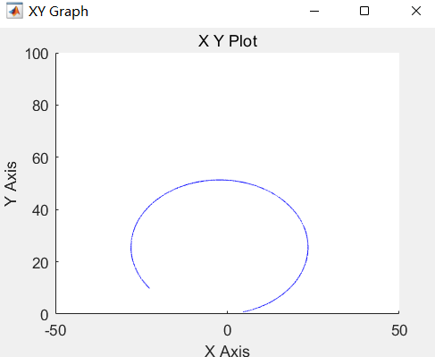

## Demo_Carsim_MPC_Tracking
基于模型预测控制（MPC）的自动驾驶汽车轨迹跟踪的Carsim-Simulink演示，展示了如何联合CarSim和Simulink来实现无人车MPC跟踪圆形轨迹效果。

### 配置
软件版本：MATLAB R2020a， CarSim 2020.0 [(安装并关联Simulink)](https://blog.csdn.net/Cynthia_2019/article/details/121953106)， Windows 11  
路径配置：根目录 _D:\CarSim2020\Carsim_Files_，子文件（_MPCtest1.mdl_, _MY_MPCController3.m_, _my_quadprog.m_），根目录可以自定义  
详细配置流程请参照 [这里](issue/Readme.md)

### 运行
1. 点击CarSim--Home中的Send to Simulink，自动打开Simulink后点击Run，等待运行完成，查看Simulink仿真结果
2. 如果需要改动CarSim中的参数如车辆参数、仿真工况，则需要先Run Now再Send to Simulink；如果改动Simulink的参数，只需要在Simulink中Run
3. 最后在CarSim--Home--Analyze Results (Post Processing)中点击Video+Plot，查看CarSim仿真结果

### 结果
Simulink中无人车的轨迹： 
 
 

  

 
 
CarSim中无人车的轨迹：  
 

https://github.com/bithuanglq/Demo_Carsim_MPC_Tracking/assets/46642752/b69457a2-bf0a-4fab-8b71-9c14a14dddc8

### 改进
参考轨迹在MY_MPCController3.m中修改

### Acknowlegement
参考自龚建伟著《无人驾驶车辆模型预测控制》
