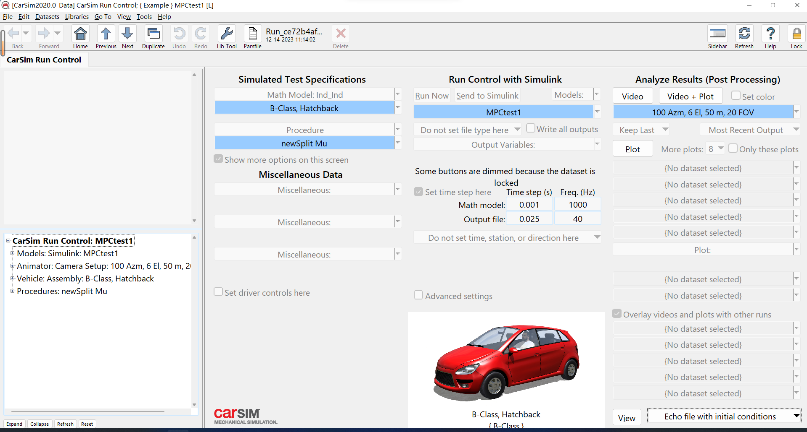
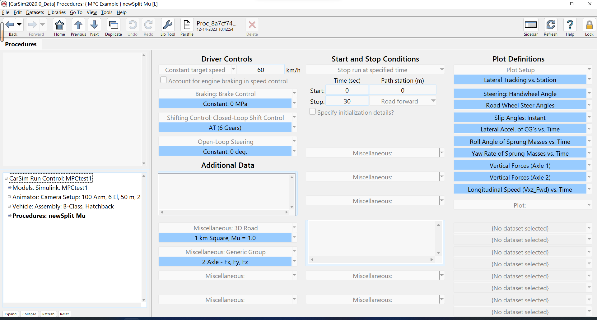
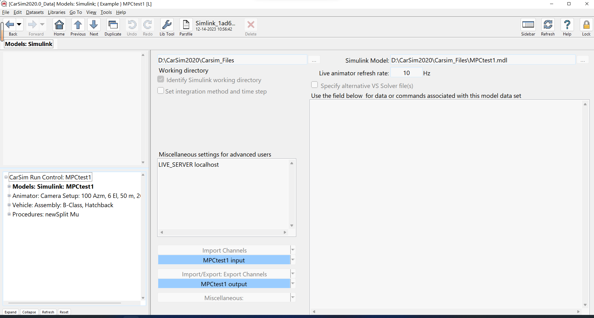
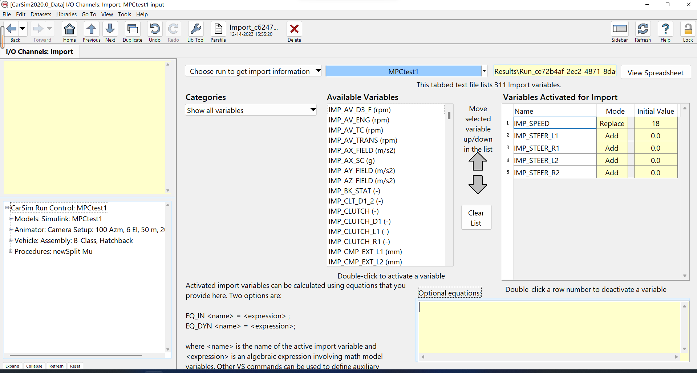
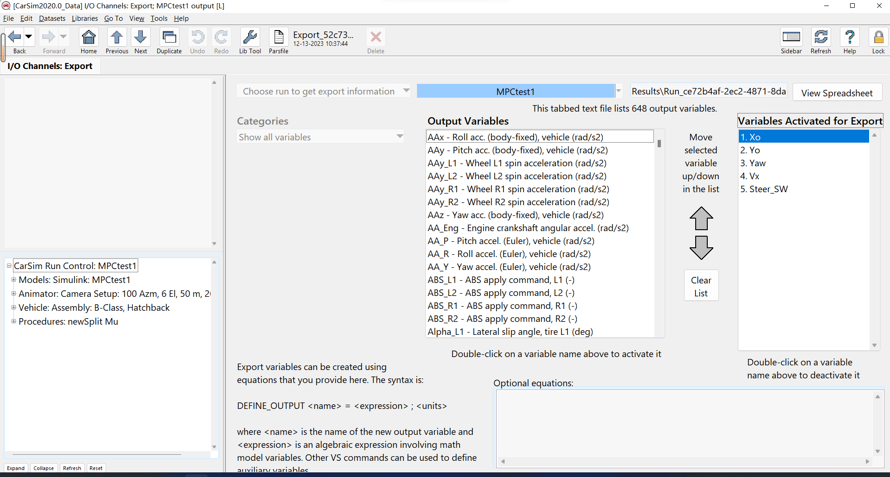
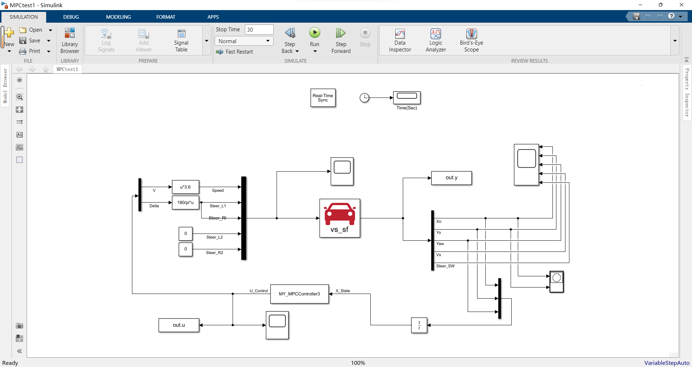

### CarSim 配置

CarSim新建Procedure为newSplit Mu， 新建Run Control with Simulink的Models为MPCtest1，最终Home页面如下：  

  

Procedure、Models配置如下：  

  

  

在Models中，新建输入MPCtest1 input，输出MPCtest1 output，配置如下： 

  

 

  

### Simulink 配置

Simulink 文件打开如下：  
 

  

